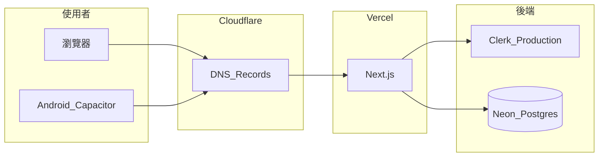

# 自訂網域：Cloudflare Registrar + Vercel + Clerk

本文件說明如何為 **volleyball-team-manager** 取得自有網域，並串接 **Vercel（網站）**、**Clerk Production（登入）** 與 **Capacitor Android 殼（Google Play）**。

> **為什麼需要自有網域？**  
> Clerk [正式環境](https://clerk.com/docs/guides/development/deployment/production) 要求你能在 DNS 新增 CNAME 等記錄；**`*.vercel.app` 無法用於 Production**（無法在 Vercel 子網域上設定 Clerk 所需 DNS）。  
> Preview／開發仍可用 `*.vercel.app`；上架與長期營運請使用自有網域。

**相關文件**：[PRODUCTION-DEPLOY.md](./PRODUCTION-DEPLOY.md)、[mobile/README.md](../mobile/README.md)、[CAPACITOR-PUSH-PROGRESS.md](./CAPACITOR-PUSH-PROGRESS.md)、[PUSH-SETUP.md](./PUSH-SETUP.md)

---

## 1. 建議架構



| 元件 | 角色 |
|------|------|
| **Cloudflare Registrar** | 購買並持有網域（例如 `example.com`） |
| **Cloudflare DNS** | 管理 A / CNAME（Vercel、Clerk） |
| **Vercel** | 託管 Next.js；自訂網域指向此專案 |
| **Clerk Production** | 登入、Session；需 DNS 驗證與寄信網域 |
| **Neon** | Postgres（與網域無關，見 PRODUCTION-DEPLOY） |
| **Capacitor** | App 以 WebView 載入 `https://你的網域` |

---

## 2. 費用預估

| 項目 | 說明 |
|------|------|
| Cloudflare Registrar（`.com`） | 多為成本價，常見約 **USD $10–12/年**（以購買畫面為準） |
| Cloudflare DNS | 免費方案通常足夠 |
| Vercel / Neon / Clerk | 依各服務免費額度或方案計費 |

請設定**自動續約**並留意到期通知；網域過期會導致網站、登入與 App 一併失效。

---

## 3. 步驟一：在 Cloudflare 購買網域

1. 登入 [Cloudflare Dashboard](https://dash.cloudflare.com)。
2. 左側 **Domain Registration** → **Register domains**。
3. 搜尋並購買網域（建議 `.com` 或你偏好的 TLD）。
4. 購買完成後，該網域會出現在 **Websites** 列表，並附 **DNS zone**。

以下範例皆以 `example.com` 代替；請換成你的實際網域。

---

## 4. 步驟二：Vercel 綁定網域

1. 開啟 [Vercel](https://vercel.com) → 專案 **volleyball-team-manager**（若 monorepo 請確認 Root Directory）。
2. **Settings → Domains** → 新增：
   - `example.com`（根網域）
   - 可選：`www.example.com`
3. Vercel 會顯示需新增的 DNS 記錄；到 **Cloudflare → 你的網域 → DNS → Records** 新增。

**常見設定（以 Vercel 當下指示為準）：**

| 類型 | 名稱 | 內容 | Proxy |
|------|------|------|-------|
| A | `@` | `76.76.21.21`（Vercel 提供的 IP） | **僅 DNS（灰雲）** |
| CNAME | `www` | `cname.vercel-dns.com` 或專案指定的目標 | **僅 DNS（灰雲）** |

4. 等待 Vercel Domains 頁顯示 **Valid**。
5. 瀏覽器開啟 `https://example.com`，確認能載入 App（可能仍為 development Clerk key，下一步再換 Production）。

> **注意**：對指向 Vercel 的記錄，預設使用 **DNS only**；除非 Vercel 文件明確建議對該記錄開啟 Proxy。

---

## 5. 步驟三：Clerk Production 與 DNS

### 5.1 建立 Production 實例

1. [Clerk Dashboard](https://dashboard.clerk.com) → 建立或切換至 **Production** application。
2. 取得 Production 的 API keys（稍後寫入 Vercel）。

### 5.2 設定 Production domain

1. Clerk → **Configure → Domains**（或 **Developers → Domains**，以 Dashboard 為準）。
2. 將 **Production domain** 設為 `example.com`（你的根網域）。
3. 畫面會列出需新增的 **DNS 記錄**（名稱與目標以 Clerk 顯示為準，勿照抄過期範例）。

**常見類型（僅作參考，請以 Dashboard 為準）：**

| 用途 | 類型 | 名稱（Host） | 目標（Value） | Proxy |
|------|------|--------------|---------------|-------|
| Frontend API | CNAME | `clerk` | Clerk 提供的 FAPI 主機名 | **僅 DNS（灰雲）** |
| Account portal（若啟用） | CNAME | `accounts` | Clerk 提供的主機名 | **僅 DNS（灰雲）** |
| Email（SPF/DKIM 等） | TXT / CNAME | 依 Clerk 指示 | 依 Clerk 指示 | 依指示 |

4. 在 Cloudflare 新增上述記錄後，回到 Clerk 等待 **Verified**（可能數分鐘至數小時）。

### 5.3 Cloudflare Proxy（橘雲）與 CAA

- **Clerk 的 CNAME**：必須 **DNS only（灰雲）**。Proxy 會導致 Clerk DNS 驗證失敗。  
  參考：[Clerk — DNS records](https://clerk.com/docs/guides/development/deployment/production#dns-records)
- **SSL 驗證失敗**：檢查根網域 **CAA** 是否過嚴（只允許 Let's Encrypt）。Clerk 可能需額外允許 `pki.goog` 等；見 Clerk Dashboard 說明。

### 5.4 Clerk URL 與 OAuth

1. **Allowed origins / Redirect URLs**：加入  
   - `https://example.com`  
   - `https://www.example.com`（若有使用 www）
2. 正式環境若使用 Google 等 OAuth，須在各家 Console 建立 **Production** 憑證（Clerk 文件有逐步說明）。
3. **App 內 WebView**：Google OAuth 在 WebView 常出現 `disallowed_useragent`；本專案建議 App 內以 **Email + 密碼** 登入（見 [mobile/README.md](../mobile/README.md)）。

---

## 6. 步驟四：Vercel 環境變數（Production）

在 Vercel → **Settings → Environment Variables**（**Production**）設定：

| 變數 | 說明 |
|------|------|
| `DATABASE_URL` | Neon pooled 連線字串 |
| `NEXT_PUBLIC_CLERK_PUBLISHABLE_KEY` | Clerk **Production** publishable key |
| `CLERK_SECRET_KEY` | Clerk **Production** secret key |
| `DEEPSEEK_API_KEY` | 選用；AI 訓練計畫 |
| `FIREBASE_*` | 選用；Android 推播，見 [PUSH-SETUP.md](./PUSH-SETUP.md) |
| `NEXT_PUBLIC_ENABLE_NATIVE_PUSH` | 僅在 FCM 與 APK 就緒後設 `true` |

**勿在 Production 開啟：**

- `ALLOW_DEBUG_AUTH`
- `ALLOW_BOOTSTRAP`

完成後 **Redeploy** Production。

### 驗收（網站）

- [ ] `https://example.com/sign-in` 可開啟  
- [ ] Clerk 登入成功後可進 `/coach` 或 `/player`  
- [ ] API 可讀寫資料（Neon 連線正常）

---

## 7. 步驟五：Capacitor Android 殼

App 為薄殼，載入遠端網址；網域變更後須同步設定。

### 7.1 設定載入網址

建置／sync 前：

```bash
export CAPACITOR_SERVER_URL="https://example.com"
cd mobile
npm install
npx cap sync android
```

或寫入 `mobile/.env`（勿提交 secret；若僅 URL 可團隊約定是否 gitignore）。

預設見 [`mobile/capacitor.config.ts`](../mobile/capacitor.config.ts)；**上架前勿使用占位網域**。

### 7.2 allowNavigation

`capacitor.config.ts` 的 `server.allowNavigation` 須包含：

- 你的根網域（例如 `example.com`）
- Clerk 相關網域（專案已含 `*.clerk.com` 等；改網域後執行 `npx cap sync`）

### 7.3 實機檢查

- [ ] 從 Android Studio 安裝的 APK 開啟（套件名 `com.volleyball.teammanager`），非「加入主畫面」捷徑  
- [ ] App 內 Email 登入／登出正常  
- [ ] 三星等機型：設定 → 應用程式 → 支援的連結 → **在此應用程式中開啟**（見 mobile/README）

---

## 8. Google Play 與隱私權政策

上架 Play Console 時通常需要：

| 項目 | 說明 |
|------|------|
| **隱私權政策 URL** | 可託管於 `https://example.com/privacy`（頁面可後續實作） |
| **商店網域** | 與使用者實際使用的網域一致 |
| **資料安全表單** | 如實填寫 Email、RSVP、身體回饋、推播 token 等 |

Android 發行包（AAB）、簽章金鑰、Firebase 推播等見團隊內部上架 checklist 或 [CAPACITOR-PUSH-PROGRESS.md](./CAPACITOR-PUSH-PROGRESS.md) 階段 C。

---

## 9. DNS 設定總覽（檢查用）

完成後，Cloudflare DNS 大致應包含（實際以 Vercel / Clerk 畫面為準）：

| 類型 | 名稱 | 指向 | 用途 |
|------|------|------|------|
| A | `@` | Vercel IP | 網站根網域 |
| CNAME | `www` | Vercel | 可選 www |
| CNAME | `clerk` | Clerk FAPI | 登入 Frontend API |
| CNAME | `accounts` | Clerk | 可選 Account Portal |
| TXT / 其他 | 依 Clerk | 依 Clerk | Email 驗證（若有） |

---

## 10. 常見問題

### Q：`*.vercel.app` 可以給 Clerk Production 用嗎？

不行。請使用自有網域並設定 DNS。Preview 部署仍可用 `*.vercel.app`。

### Q：免費網域（如 `.dpdns.org`）可以嗎？

技術上可能可行，但不建議作為正式產品與 Play 上架的唯一網域（信任度、郵件送達、政策風險）。Cloudflare Registrar 的 `.com` 較合適。

### Q：改網域後 App 要重裝嗎？

- **只改 Vercel 網站內容**：殼仍載同一 URL 時，通常不必重裝。  
- **改 `CAPACITOR_SERVER_URL` 或原生設定**：需重新 `cap sync` 並打新的 AAB／APK。

### Q：Clerk 一直未 Verified

1. Clerk 相關 CNAME 是否 **灰雲**  
2. 記錄名稱／目標是否與 Dashboard 完全一致  
3. 根網域 CAA 是否阻擋 Google Trust Services / DigiCert  

### Q：登入後被導到錯誤網域

檢查 Clerk Production 的 redirect URL 與 Vercel 實際網域是否一致；環境變數是否混用 Development / Production keys。

---

## 11. 完成檢查清單

- [ ] Cloudflare 已購買並持有網域  
- [ ] Vercel 自訂網域 Valid，`https://example.com` 可開  
- [ ] Clerk Production domain 已設定且 DNS Verified  
- [ ] Vercel Production 已換 Clerk Production keys 並 redeploy  
- [ ] Production 未開啟 debug / bootstrap  
- [ ] `CAPACITOR_SERVER_URL` 指向 `https://example.com`，已 `cap sync`  
- [ ] 實機 App 登入與教練／球員流程正常  
- [ ] （上架前）隱私權政策 URL 可公開存取  

---

## 12. 參考連結

- [Clerk — Deploy to production](https://clerk.com/docs/guides/development/deployment/production)
- [Clerk — Deploying to Vercel](https://clerk.com/docs/guides/development/deployment/vercel)
- [Vercel — Custom domains](https://vercel.com/docs/projects/domains)
- [Cloudflare Registrar](https://developers.cloudflare.com/registrar/)
- [Cloudflare DNS — Full setup](https://developers.cloudflare.com/dns/zone-setups/full-setup/setup/)
