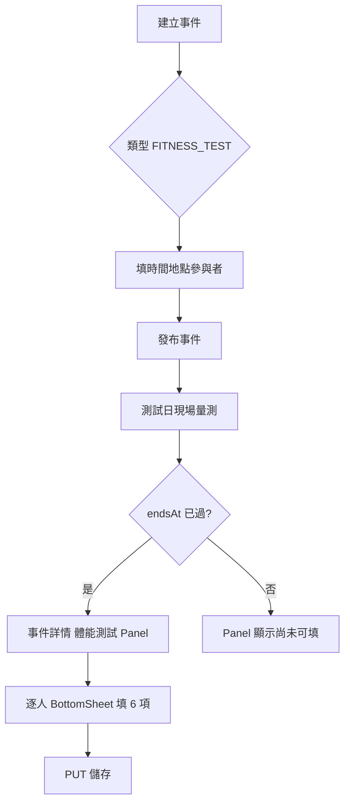
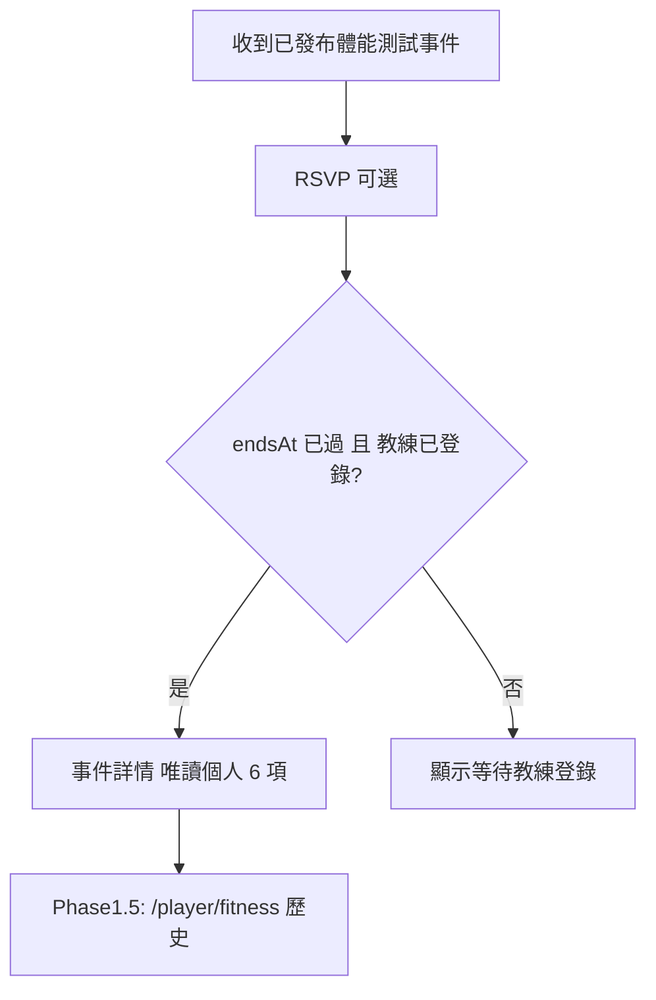
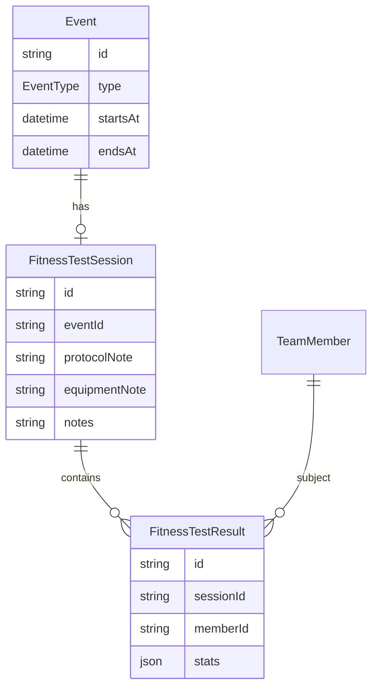
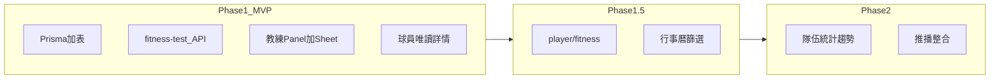

# 體能測試功能 — 設計規格

> **分支**：`addAdmin`  
> **最後更新**：2026-09-11  
> **狀態**：Phase 1 MVP 已完成（2026-09-11）→ Phase 1.5 待做  
> **相關進度**：[MVP-PROGRESS.md](./MVP-PROGRESS.md)

---

## 1. 背景與目標

### 1.1 需求摘要

在現有「訓練計畫」「比賽統計」之外，新增 **體能測試** 能力：教練建立體能測試日（行事曆事件），現場量測後登錄各隊員數據；球員事後 **唯讀** 查看個人成績。

### 1.2 產品定位

體能測試是第三類 **事件型 per-player 數值紀錄**，模式對齊比賽統計（`MatchResult` + `MatchPlayerStat`）：

| 維度 | 訓練 | 比賽 | 體能測試（新） |
|------|------|------|----------------|
| 事件類型 | `TRAINING` | `MATCH` | `FITNESS_TEST` |
| 父表 | `TrainingPlan` | `MatchResult` | `FitnessTestSession` |
| 子表 | — | `MatchPlayerStat` | `FitnessTestResult` |
| 誰填 | 教練（計畫）+ 球員（RPE） | 教練 | **教練** |
| 球員端 | 唯讀計畫 + 填回饋 | 唯讀比分／個人統計 | **唯讀個人成績** |

**註解**：沿用「事件結束後教練登錄、球員事後查看」節奏，權限參考 `src/app/api/events/[id]/match-result/route.ts`。

### 1.3 設計決策（已確認）

| 決策 | 選擇 |
|------|------|
| 場次組織 | 綁定行事曆事件，新增 `EventType.FITNESS_TEST` |
| 球員端 | 唯讀查看個人成績（不含自行填寫） |
| 多運動 | 六項測試不綁 `SportModule`，排球／足球／籃球隊伍皆可用 |

---

## 2. 測試項目與單位

### 2.1 項目一覽

| ID | 中文名 | key | 單位 | 嘗試次數 | 紀錄內容 | 顯示指標 |
|----|--------|-----|------|----------|----------|----------|
| 1 | 深蹲跳 | `squatJump` | cm | **3** | 每次跳高（小數 1 位） | 最佳值 max |
| 2 | CMJ | `cmj` | cm | **3** | 同上 | 最佳值 max |
| 3 | 助跑跳 | `approachJump` | cm | **3** | 同上 | 最佳值 max |
| 4 | 深度跳 | `depthJump` | cm | **3** | 同上 | 最佳值 max |
| 5 | 排球場折返跑 | `courtShuttle` | sec | **1** | 完成時間（小數 2 位） | 唯一值 |
| 6 | 雙手擲藥球 | `medicineBallThrow` | m | **3** | 投擲距離（小數 2 位） | 最佳值 max |

**註解**：

- `null` = 該次未測／跳過；至少 1 次非 null 才視為該項目「有紀錄」。
- 跳高／藥球 **越大越好**；折返跑 **越小越好**（UI 顯示時可標註方向）。

### 2.2 折返跑協議（v1 預設）

| 項目 | 內容 |
|------|------|
| 協議名稱 | 排球場端線折返跑（1 趟） |
| 定義 | 自一端端線出發 → 跑至對面端線以手觸線 → 折返 → 回到出發端線觸線停止 |
| 紀錄 | 總秒數（sec） |
| 可覆寫 | `FitnessTestSession.protocolNote`（例：「本場使用 9m × 4 折返協議」） |

**註解**：Phase 2 若需多種協議 enum，再擴充；v1 固定預設文案 + 文字備註。

### 2.3 藥球規格（v1 建議預設）

| 項目 | 內容 |
|------|------|
| 預設重量 | 3 kg（建議值，非強制） |
| 投擲方式 | 雙手過頭向前擲，測量落點距離（m） |
| 可覆寫 | `FitnessTestSession.equipmentNote`（例：「藥球 4 kg」） |

### 2.4 驗證規則（Zod 草案）

實作檔：`src/lib/fitness/test-schema.ts`

```typescript
// 跳高（cm）：0–150，nullable
const jumpCm = z.number().min(0).max(150).nullable();

// 折返跑（sec）：1–300，nullable
const shuttleSec = z.number().min(1).max(300).nullable();

// 藥球（m）：0–30，nullable
const throwM = z.number().min(0).max(30).nullable();

// 固定陣列長度
squatJump:       { attempts: [jumpCm, jumpCm, jumpCm] }
courtShuttle:    { attempts: [shuttleSec] }
medicineBallThrow: { attempts: [throwM, throwM, throwM] }
```

**best 計算**（server 端 `compactFitnessStats()`）：

- 跳類、藥球：`max(non-null attempts)`
- 折返跑：`attempts[0]`（唯一值）
- client **不可** 自行寫入 `best`（防篡改）

---

## 3. 使用者流程

### 3.1 教練端



1. `/coach/events/new` → 類型選「體能測試」→ 建立草稿 → 發布  
2. 測試當日完成量測  
3. 事件 `endsAt` 之後 → 事件詳情 →「體能測試」區塊 → 點隊員 → BottomSheet 填寫 → 儲存  

### 3.2 球員端



**註解**：Phase 1 僅事件詳情唯讀；Phase 1.5 加 `/player/fitness` 歷史列表。

---

## 4. 資料模型

### 4.1 ER 圖



### 4.2 Prisma 新增

```prisma
enum EventType {
  TRAINING
  MATCH
  OTHER
  FITNESS_TEST  // 新增
}

model FitnessTestSession {
  id             String   @id @default(cuid())
  eventId        String   @unique
  protocolNote   String?  // 折返跑協議覆寫
  equipmentNote  String?  // 藥球重量等
  notes          String?  // 場次整體備註
  createdAt      DateTime @default(now())
  updatedAt      DateTime @updatedAt
  event          Event    @relation(fields: [eventId], references: [id], onDelete: Cascade)
  results        FitnessTestResult[]
}

model FitnessTestResult {
  id        String   @id @default(cuid())
  sessionId String
  memberId  String
  stats     Json     @default("{}")
  createdAt DateTime @default(now())
  updatedAt DateTime @updatedAt
  session   FitnessTestSession @relation(fields: [sessionId], references: [id], onDelete: Cascade)
  member    TeamMember @relation(fields: [memberId], references: [id], onDelete: Cascade)
  @@unique([sessionId, memberId])
  @@index([memberId])
}
```

`Event` 新增 relation：`fitnessTestSession FitnessTestSession?`  
`TeamMember` 新增 relation：`fitnessTestResults FitnessTestResult[]`

### 4.3 JSON `stats` 範例

```json
{
  "squatJump": {
    "attempts": [42.5, 43.0, null],
    "best": 43.0,
    "unit": "cm"
  },
  "cmj": {
    "attempts": [38.0, 37.5, 39.2],
    "best": 39.2,
    "unit": "cm"
  },
  "approachJump": {
    "attempts": [null, null, null],
    "best": null,
    "unit": "cm"
  },
  "depthJump": {
    "attempts": [40.1, 41.0, 40.8],
    "best": 41.0,
    "unit": "cm"
  },
  "courtShuttle": {
    "attempts": [12.34],
    "best": 12.34,
    "unit": "sec"
  },
  "medicineBallThrow": {
    "attempts": [8.5, 9.0, 8.8],
    "best": 9.0,
    "unit": "m"
  }
}
```

### 4.4 TypeScript 型別（草案）

```typescript
export type FitnessTestItemKey =
  | "squatJump"
  | "cmj"
  | "approachJump"
  | "depthJump"
  | "courtShuttle"
  | "medicineBallThrow";

export type FitnessTestItem = {
  attempts: (number | null)[];
  best: number | null;
  unit: "cm" | "sec" | "m";
};

export type FitnessTestStats = Record<FitnessTestItemKey, FitnessTestItem>;
```

---

## 5. API 規格

**Base**：`/api/events/[id]/fitness-test`

| 方法 | 說明 | 權限 |
|------|------|------|
| `GET` | 讀取 session + results | 教練：全員；球員：僅本人 |
| `PUT` | upsert session + 批次寫入 results | 教練／ADMIN／COACH_PLAYER |
| `DELETE` | 清除整場數據 | 教練（Phase 1 可選） |

### 5.1 GET 回應

```json
{
  "session": {
    "id": "cuid",
    "protocolNote": null,
    "equipmentNote": "藥球 3 kg",
    "notes": "賽季前體測",
    "updatedAt": "2026-09-11T10:00:00.000Z"
  },
  "results": [
    {
      "memberId": "cuid",
      "displayName": "王小明",
      "stats": { "...": "見 §4.3" }
    }
  ]
}
```

無 session 時：`{ "session": null, "results": [] }`

### 5.2 PUT 請求 body

```json
{
  "protocolNote": "端線折返 1 趟",
  "equipmentNote": "藥球 3 kg",
  "notes": "賽季前體測",
  "playerResults": [
    {
      "memberId": "cuid",
      "stats": {
        "squatJump": { "attempts": [42.5, 43.0, null] },
        "cmj": { "attempts": [38.0, 37.5, 39.2] },
        "approachJump": { "attempts": [null, null, null] },
        "depthJump": { "attempts": [40.1, 41.0, 40.8] },
        "courtShuttle": { "attempts": [12.34] },
        "medicineBallThrow": { "attempts": [8.5, 9.0, 8.8] }
      }
    }
  ]
}
```

**註解**：PUT body 只需 `attempts`；`best` 與 `unit` 由 server 計算補齊。

### 5.3 守衛規則

| # | 規則 | HTTP |
|---|------|------|
| 1 | 須登入且有隊籍 | 401 |
| 2 | 事件須屬於目前隊伍 | 404 |
| 3 | `event.type === FITNESS_TEST` | 400 |
| 4 | PUT：須 `canManageMatchResult` 同等教練權限 | 403 |
| 5 | PUT：須 `isEventEnded(endsAt)` | 400 |
| 6 | `memberId` 須在 `EventParticipant` | 400 |
| 7 | 球員 GET：只回傳 `memberId === 自己` | — |

### 5.4 Transaction

```
upsert FitnessTestSession (by eventId)
→ deleteMany FitnessTestResult where sessionId
→ createMany results（每筆 stats 經 compactFitnessStats）
```

### 5.5 錯誤碼摘要

| error | 說明 |
|-------|------|
| `未授權` | 401 |
| `找不到事件` | 404 |
| `僅體能測試事件可登錄數據` | 400 |
| `事件尚未結束，無法登錄體能數據` | 400 |
| `無權限登錄體能數據` | 403 |
| `無效的隊員或數據格式` | 400（Zod） |

---

## 6. UI 線框與元件對照

### 6.1 建立／編輯事件

**檔案**：`event-create-form.tsx`、`event-edit-form.tsx`

| 變更 | 說明 |
|------|------|
| 類型下拉 | 新增「體能測試」→ `FITNESS_TEST` |
| 條件顯示 | 隱藏訓練計畫、比賽專用欄位 |
| 可選欄位 | 協議備註、器材備註（寫入 session 或事件 description） |

### 6.2 教練事件詳情 — FitnessTestPanel

**檔案**：`src/app/coach/(main)/events/[id]/fitness-test-panel.tsx`（新）

```
┌─────────────────────────────────────────┐
│ 體能測試                          [儲存] │
├─────────────────────────────────────────┤
│ 折返跑協議：端線來回 1 趟（可編輯備註）   │
│ 器材備註：[藥球 3 kg        ]            │
│ 場次備註：[________________]            │
├─────────────────────────────────────────┤
│ 隊員          │ 深蹲跳 │ CMJ │ … │ 狀態 │
│ 王小明 #7     │ 43.0  │39.2 │ … │ 已填 │
│ 李小華 #12    │  —    │ —   │ … │ 未填 │
│ （點列 → BottomSheet）                   │
└─────────────────────────────────────────┘
```

**BottomSheet 內**（6 tab 或 scroll 6 區）：

```
[深蹲跳] [CMJ] [助跑跳] [深度跳] [折返跑] [藥球]

Attempt 1: [____] cm
Attempt 2: [____] cm
Attempt 3: [____] cm
最佳：43.0 cm
```

**元件對照**：

| 新元件 | 參考 |
|--------|------|
| `FitnessTestPanel` | `match-result-panel.tsx` |
| `FitnessTestInputSection` | `match-player-stats-input-section.tsx` |
| `FitnessTestReadonly` | `match-result-readonly.tsx` |

**數字輸入**：擴充 `src/lib/numeric-input.ts` 支援小數（cm 1 位、sec/m 2 位）。

### 6.3 球員事件詳情 — 唯讀

**檔案**：`src/app/player/(main)/events/[id]/fitness-test-readonly.tsx`（新）

- 條件：`event.type === FITNESS_TEST && afterEnd && 有本人 result`
- 顯示 6 項：3 次 raw + 最佳；折返跑 1 次
- 無數據：「教練尚未登錄你的體能數據」

### 6.4 Phase 1.5 — 球員歷史

**路由**：`/player/fitness`（仿 `/player/feedback`）

- 依 `startsAt` 降序列出 `FITNESS_TEST` 事件
- 每場卡片：日期 + 6 項 best
- 底部 nav tab：Phase 1.5 再加

### 6.5 Phase 2 — 教練隊伍統計

**路由**：`/coach/team/stats` 新增區塊

- 各隊員最新 vs 上一場 Δ
- 折返跑／跳高趨勢圖（參考 `match-stats-charts.tsx`）

---

## 7. 權限與邊界案例

### 7.1 權限矩陣

| 動作 | ADMIN/COACH | COACH_PLAYER | PLAYER |
|------|:-----------:|:------------:|:------:|
| 建立 FITNESS_TEST 事件 | ✓ | ✓ | ✗ |
| 填寫全隊數據 | ✓ | ✓ | ✗ |
| 查看全隊數據 | ✓ | ✓ | ✗ |
| 查看個人數據 | ✓ | ✓ | ✓（僅自己） |
| 刪除場次數據 | ✓ | ✓ | ✗ |

### 7.2 邊界案例

| 案例 | 行為 |
|------|------|
| 複製事件 | **不複製** fitness results（僅 meta） |
| 取消事件 | session/results 保留；UI 可標「已取消」 |
| 隊員 mid-test 離隊 | 既有 result 保留；新登錄須 ACTIVE participant |
| 部分項目未測 | attempts 可 null；best 僅算有值者 |
| 非 FITNESS_TEST 打 API | 400 |
| 草稿未發布 | 球員看不到；教練可預覽 Panel（結束前不可填） |

---

## 8. 分期實作與驗收



### Phase 1 MVP — 驗收標準

- [x] Migration 套用成功
- [x] 可建立 `FITNESS_TEST` 事件並發布
- [x] 事件結束後教練可 PUT 儲存全隊 6 項
- [x] 3 次項目可填 1–3 次；折返跑 1 次
- [x] best 由 server 計算正確
- [x] 球員在事件詳情唯讀看到個人數據
- [x] `npm run build` 通過

### 體能測試事件 UI 精簡（v1.1）

教練／球員事件詳情對 `FITNESS_TEST` **不顯示**：點名、企位、戰術影片、留言、評語、身體回饋、RSVP（球員端）。

**保留**：

- 教練：編輯事件（未結束）、體能測試 Panel（已結束）
- 球員：體能成績唯讀（已結束）

### Phase 1.5

- [x] `/player/fitness` 歷史頁
- [x] 球員 bottom nav／toolbar「體能」入口
- [x] 事件列表 `FITNESS_TEST` 篩選（Phase 1 已有）

### Phase 2

- [x] `/coach/team/stats` 體能趨勢
- [x] 推播（教練登錄成績 → 有數據球員）
- [x] CSV 匯出（單場事件 + 隊伍趨勢）

---

## 9. 待確認事項

| # | 問題 | 預設（v1） | 你的決定 |
|---|------|------------|----------|
| 1 | 填寫時機 | 事件 `endsAt` 之後 | ☐ 同意 ☐ 改為發布後即可 |
| 2 | 折返跑協議 | 端線來回 1 趟 | ☐ 同意 ☐ 其他：____ |
| 3 | 藥球重量 UI | 僅備註文字 | ☐ 同意 ☐ 下拉 2/3/4 kg |
| 4 | Phase 1 含歷史頁 | 否（Phase 1.5） | ☐ 同意 ☐ Phase 1 就要 |

---

## 附錄：主要檔案清單（Phase 1）

| 類型 | 路徑 |
|------|------|
| Schema | `prisma/schema.prisma` + migration |
| 驗證 | `src/lib/fitness/test-schema.ts` |
| API | `src/app/api/events/[id]/fitness-test/route.ts` |
| 教練 UI | `src/app/coach/(main)/events/[id]/fitness-test-panel.tsx` |
| 輸入 | `src/components/fitness-test-input-section.tsx` |
| 球員 UI | `src/app/player/(main)/events/[id]/fitness-test-readonly.tsx` |
| 事件表單 | `event-create-form.tsx`、`event-edit-form.tsx` |
| 詳情頁 | `coach/.../events/[id]/page.tsx`、`player/.../events/[id]/page.tsx` |
| 篩選 | `events-list-filters.tsx` |
