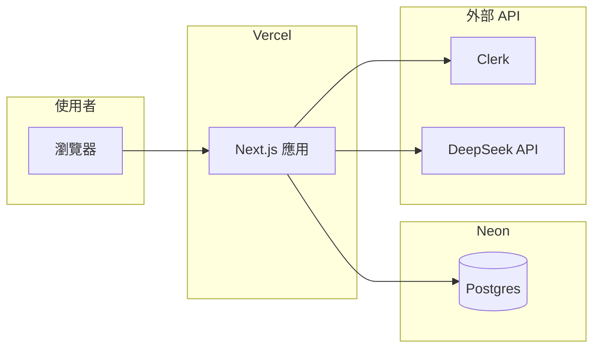

# 正式環境部署檢查清單

本文件整理將 **volleyball-team-manager** 上線到 production 時建議完成的工作。技術棧為 Next.js 16（App Router）+ Prisma 7 + Postgres + Clerk；AI 為伺服端呼叫 DeepSeek。

## 1. 架構是否適用「Vercel + Neon + Render」？

| 服務 | 是否適合本專案 | 說明（註解） |
|------|----------------|--------------|
| **Neon** | 是 | Postgres 與 Prisma 完全相容；Serverless 環境請優先使用 **pooled / serverless** 連線字串，避免連線數耗盡。 |
| **Vercel** | 是 | 全站為 Next 單體（頁面 + `app/api`）；Clerk `middleware` 與 Serverless Functions 皆為常見組合。 |
| **Render** | 選用 | 本 repo **沒有**獨立於 Next 之外的 API 服務；**最小架構只需 Vercel + Neon**。Render 適合未來加 **Cron、背景 Worker、獨立微服務** 時再開。 |

建議最小架構：

若你過去習慣「三件套」：可將 **Next 只部署在 Vercel**，Neon 當 DB；**Render 可先不用**，等有排程或長任務需求再接入。

---

## 2. Neon（資料庫）

1. 在 [Neon](https://neon.tech) 建立專案與資料庫分支（production 建議獨立 branch 或專案）。
2. 複製 **連線字串** 到部署平台的環境變數 **`DATABASE_URL`**。
   - Vercel Serverless：優先使用 Neon 儀表板標示的 **pooled**（或 `-pooler` 主機名）連線，利於連線池。
   - 確認字串含 **`sslmode=require`**（或 Neon 預設已帶入），避免連線被拒。
3. **不要**把 production `DATABASE_URL` 寫進版本庫；僅存在託管平台 Secret / 本機 `.env`（已 gitignore）。

---

## 3. Vercel（Next 應用）

1. 將 Git 倉庫連結至 Vercel；若 monorepo 且本 app 在子目錄，在專案設定填 **Root Directory**（例如 `volleyball-team-manager`）。
2. **Framework**：Next.js（預設即可）。Build 通常為 `npm run build`（`package.json` 已定義）。
3. **`postinstall`** 已執行 `prisma generate`，建置時需能安裝依賴；無需額外 plugin 即可產生 Prisma Client。
4. 在 Vercel **Environment Variables** 設定（與 [`.env.example`](../.env.example) 對照，production 必填／建議）：

| 變數 | 說明 |
|------|------|
| `DATABASE_URL` | Neon 連線字串（建議 pooled） |
| `NEXT_PUBLIC_CLERK_PUBLISHABLE_KEY` | Clerk 公開 key |
| `CLERK_SECRET_KEY` | Clerk 伺服端 secret |
| `DEEPSEEK_API_KEY` | 訓練計畫 AI（未設則 AI 路由 503） |
| `DEEPSEEK_MODEL` | 選用，預設 `deepseek-chat` |
| `DEEPSEEK_BASE_URL` | 選用，預設 `https://api.deepseek.com` |

5. **Build 階段與 DB**：若你在 Vercel build 時執行 `prisma migrate deploy`，該次 build 必須能連到 **目標 DB**（會把 Neon 密碼放進 build env）。較安全的常見做法：
   - **首次上線**：在本機或 CI（具 `DATABASE_URL`）對 production DB 執行一次 `npx prisma migrate deploy`，再觸發 Vercel deploy；或
   - 使用 Vercel 的 **production 環境變數** 讓 build 可連 DB，並在 `package.json` 的 build 前加上 migrate（需團隊約定，避免誤對錯誤 DB）。

6. 部署完成後記下 **Production URL**（例如 `https://xxx.vercel.app`），供 Clerk 設定使用。

---

## 4. Prisma Migrations

1. **永遠對 production 使用** `npx prisma migrate deploy`，**不要**對 production 跑 `prisma migrate dev`（會建立新 migration 檔並改動開發流程）。
2. Schema 變更流程：本機 `prisma migrate dev` → commit `prisma/migrations` → merge 後在可連 production DB 的環境執行 `migrate deploy` → 再部署應用。
3. `prisma.config.ts` 從環境變數讀取 `DATABASE_URL`；確認 Vercel **Runtime** 與（若有用）**Build** 皆注入正確的 `DATABASE_URL`。

---

## 5. Clerk（Production）

1. 在 [Clerk Dashboard](https://dashboard.clerk.com) 的 **Production** 實例（或獨立 Production Application）取得 `NEXT_PUBLIC_CLERK_PUBLISHABLE_KEY` 與 `CLERK_SECRET_KEY`。
2. **Allowed origins / Redirect URLs**：加入 Vercel production 網域與自訂網域（若有）。
3. 確認 **Sign-in / Sign-up** 路徑與本專案路由一致（例如 `/sign-in/[[...sign-in]]`）。
4. 開發與正式建議分開 key，避免誤把 development secret 部署到 production。

---

## 6. 正式環境必關閉／檢查（安全）

| 項目 | 要求（註解） |
|------|----------------|
| `ALLOW_DEBUG_AUTH` | **勿**在 production 設為 `true`（會允許 header／cookie 繞過 Clerk）。 |
| `ALLOW_BOOTSTRAP` | **勿**在 production 開啟；README 明 production 會強制關閉的條件請一併遵守。 |
| `DEEPSEEK_API_KEY` | 僅存伺服端；勿使用 `NEXT_PUBLIC_` 前綴。 |
| API Key 輪替 | 若曾將 key 提交至 git，請在 DeepSeek／Clerk 後台輪替。 |

---

## 7. Render（選用）

若目前 **沒有** Cron、Worker、第二個 HTTP 服務需求，**可跳過 Render**。

若未來要在 Render 跑獨立程序：

- 另建 **Background Worker** 或 **Cron Job**，與 Vercel 上的 Next 透過同一 `DATABASE_URL` 或 queue 通訊；或
- 若改為 **整包 Next 部署在 Render Web Service**：需設定 Node 版本、`npm ci` / `npm run build`、`npm start`（`next start`），並自行處理水平擴展與 cold start；此時 Vercel 可不用。

本 repo 未附 `render.yaml`；若需要 Blueprint 可另開議題新增。

---

## 8. 上線後驗證（Smoke）

建議依序手動或自動化檢查：

1. 首頁與 `/sign-in` 可開啟；Clerk 登入成功。
2. `/coach` 與 `/player` 導向與 RBAC 正常（非教練不可進教練端等）。
3. 任選一 API：例如建立／讀取事件（確認 DB 連線與 session）。
4. 多隊帳號：頂部切換隊伍後，隊伍頁設定是否與當前隊一致（曾修復 cookie／client key）。
5. 訓練事件：**用 AI 產生訓練計畫**（需 `DEEPSEEK_API_KEY` 與帳戶餘額）；失敗時看 Vercel Function log。
6. 確認 production **未**開啟 bootstrap／debug auth。

---

## 9. 相關文件

- 本機環境變數範例：[`.env.example`](../.env.example)
- 產品 MVP 進度：[MVP-PROGRESS.md](./MVP-PROGRESS.md)
- 工作區規格（上層）：`docs/volleyball-team-manager/`

完成以上項目後，即可視為 production 部署就緒；後續再加自訂網域、監控、備份策略即可。
